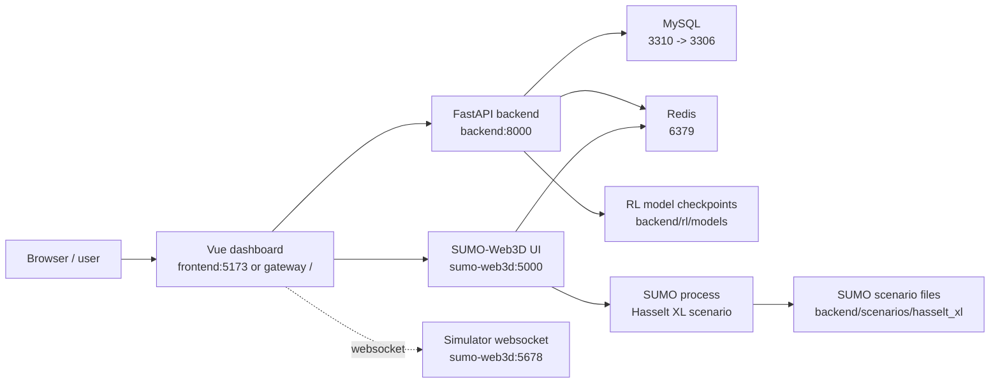
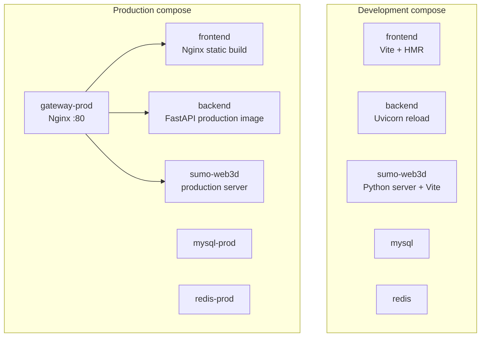

# VROOM: AI Traffic Control for Hasselt XL

[](https://github.com/GlennClaes/VROOM-Vehicle-aware-Regulation-for-Optimized-Orchestration-of-urban-Mobility/actions/workflows/CI.yml)
[](https://github.com/GlennClaes/VROOM-Vehicle-aware-Regulation-for-Optimized-Orchestration-of-urban-Mobility/actions/workflows/CD.yml)
[](https://github.com/GlennClaes/VROOM-Vehicle-aware-Regulation-for-Optimized-Orchestration-of-urban-Mobility/actions/workflows/security.yml)
[](https://github.com/GlennClaes/VROOM-Vehicle-aware-Regulation-for-Optimized-Orchestration-of-urban-Mobility/releases)
[](https://github.com/GlennClaes/VROOM-Vehicle-aware-Regulation-for-Optimized-Orchestration-of-urban-Mobility/actions/workflows/CI.yml)
[](https://github.com/GlennClaes/VROOM-Vehicle-aware-Regulation-for-Optimized-Orchestration-of-urban-Mobility/actions/workflows/CI.yml)

VROOM is a research project for traffic-light control in the Hasselt XL SUMO network. The application combines a Vue dashboard, a FastAPI backend, a SUMO/Three.js 3D simulator and a PyTorch DQN-based reinforcement-learning pipeline. The goal is to compare fixed-time traffic control with learned control strategies and to make the simulation easy to run, inspect and evaluate.

The project is built around one shared scenario folder, `backend/scenarios/hasselt_xl`, and the trained model checkpoints in `backend/rl/models`. The frontend controls the simulation, the backend exposes API and RL endpoints, and `sumo-web3d` renders the live SUMO state in the browser.

## Quick Start

You need Docker Desktop with Docker Compose. For local training outside Docker you also need Python 3.11 and SUMO available on your machine.

The easiest way to run project commands is the interactive VROOM menu:

```bash
./vroom.sh

# or through make
make vroom
```

Pick option `2` for development or option `3` for the production-style stack. Option `2` runs `make dev`. The menu calls the Makefile targets underneath, so every action is still reproducible as a direct command.

```bash
# same as VROOM menu option 2
make dev

# rebuild manually when Dockerfiles or dependencies changed
make dev-build
```

After startup:

| Service | URL / port | Purpose |
| --- | --- | --- |
| Frontend dashboard | http://localhost:5173 | Main development UI |
| Backend API | http://localhost:8000 | FastAPI service |
| API docs | http://localhost:8000/docs | Swagger/OpenAPI docs |
| SUMO-Web3D | http://localhost:5000 | 3D simulation service |
| SUMO-Web3D Vite client | http://localhost:3000 | Dev client for the simulator |
| Simulator websocket | ws://localhost:5678 | Live simulation updates |
| MySQL | localhost:3310 | Development database, container port 3306 |
| Redis | localhost:6379 | Shared runtime state/cache |

For the production-style stack:

```bash
make prod
```

Production is served through the Nginx gateway on http://localhost. The gateway routes `/` to the frontend, `/api/` to FastAPI, `/map/` to SUMO-Web3D and `/ws-simulator/` to the simulator websocket.

For the complete production-preparation stack with dashboard, backend, SUMO-Web3D, MySQL, Redis, NATS and mocked real traffic-light controllers:

```bash
cp .env.example .env
docker compose -f docker-compose.production-real.yml up --build
```

Use `production-real-traffic-lights/.env.example` as the starting point for controller-specific environment variables.

## Architecture



The development stack exposes every service directly. The production stack adds `gateway-prod`, an Nginx reverse proxy, and uses production Dockerfiles for backend, frontend and SUMO-Web3D.



## Production-Ready Traffic-Light Control

VROOM now has two traffic-light control layers:

### 1. Research and simulation control

The backend RL architecture supports communicating intersections through the Python-side [CommunicationManager](backend/rl/core/vroom_architecture.py). Intersections can exchange queue status, vehicle counts, priority detections, incidents and predicted inflow trends. Heavy forecasting helpers are accelerated through [prediction_engine.cpp](backend/rl/core/prediction_engine.cpp), compiled by [compile_cpp.py](backend/rl/core/compile_cpp.py), loaded through `ctypes`, and backed by a Python fallback when a compiler is unavailable.

### 2. Physical traffic-light preparation

The new [production-real-traffic-lights](production-real-traffic-lights) module prepares the project for real traffic-light cabinets:

- C++17 controller core for predictable latency, explicit resource ownership and low-level hardware integration.
- Hardware abstraction layer with mock, GPIO and PLC adapter boundaries.
- Dependency-free C++ tests for the message protocol and fallback controller.
- NATS-ready heartbeat/state/intent/command message formats.
- Fail-safe behavior: lost communication triggers all-red first, then a local fixed-time fallback cycle.
- Dockerfile, local compose file, `.env.example`, protocol docs and safety docs.

The module is production-oriented preparation, not a certified road-side controller by itself. A real public-road deployment still needs certified PLC/GPIO bindings, cabinet wiring validation, hardware watchdogs, local traffic-engineering rules and regulatory acceptance testing.

## Repository Structure

```text
.
|-- .github/workflows/       # CI, CD, security scan, tagging and PR helper workflows
|-- backend/                 # FastAPI app, database models, RL code and SUMO scenarios
|   |-- app/                 # API routes, auth, config, database sessions and tests
|   |-- rl/                  # DQN agent, SUMO environment, training and evaluation scripts
|   |-- scenarios/hasselt_xl # SUMO network, route files, profiles and generated outputs
|   `-- Dockerfile.*         # dev, prod and training images
|-- dashboard/               # Top-level dashboard index; implementation remains in frontend/
|-- frontend/                # Vue dashboard, Pinia stores, Vitest tests and UI components
|-- simulation/              # Top-level simulation index; implementation remains in sumo-web3d/
|-- sumo-web3d/              # SUMO/Three.js simulator service and 3D viewer
|-- production-real-traffic-lights/
|   |-- include/             # C++ HAL, protocol and controller interfaces
|   |-- src/                 # Controller, adapters, logger and CLI entrypoint
|   |-- tests/               # C++ protocol and fallback tests
|   |-- docs/                # Real-light protocol and safety notes
|   `-- docker/              # Production controller Dockerfile
|-- docs/                    # Documentation entry point and docs-site guidance
|-- docs-site/               # Visual Vue/Vite documentation site for GitHub Pages
|-- docker/                  # Deployment notes for compose files and service images
|-- research/                # Paper, assignment, sprint sources, diagrams and SOURCES.md
|-- src/                     # Architectural source-layout index
|-- tests/                   # Test-location index across backend/frontend/controller
|-- database/schema.sql      # MySQL schema loaded by Docker Compose
|-- scripts/                 # Local helper scripts used by VROOM menu, Makefile and manual checks
|-- docker-compose.yml       # Development stack
|-- docker-compose.prod.yml  # Production-style stack with gateway
|-- docker-compose.production-real.yml
|                              # Full stack with dashboard, backend, SUMO, NATS and real-light mocks
|-- nginx.gateway.conf       # Production reverse proxy routes
`-- Makefile                 # Direct command shortcuts used by vroom.sh
```

## VROOM Menu and Makefile Commands

Most day-to-day work starts from `./vroom.sh`. It is the control center for the project and maps menu choices to Makefile targets. Use the Makefile commands directly when you want a non-interactive command for CI, scripts or terminal history.

| Menu option | Label | Runs |
| --- | --- | --- |
| `1` | Build Setup | `make setup` |
| `2` | Start Development | `make dev` |
| `3` | Start Production | `make prod` |
| `4` | Live Health Dashboard | `make dashboard` |
| `5` | Bekijk Live Logs | `make logs` |
| `6` | API Status Check | `make status` |
| `7` | Start AI Training | `make train` |
| `8` | Evalueer AI Model | `make eval` |
| `9` | Volledige CI Test | `make test` |
| `10` | Code Quality Check | `make quality` |
| `11` | VROOM System Doctor | `make doctor` |
| `12` | Backup DB & Models | `make backup` |
| `13` | Restore Last Backup | `make restore` |
| `14` | Docker System Prune | `make prune` |
| `15` | Stop alle services | `make stop` |
| `16` | Hard Clean / Reset | `make clean` |
| `17` | Test Backend Only | `make test-backend` |
| `18` | Test Frontend Only | `make test-frontend` |
| `19` | Frontend Watch Mode | `make test-frontend-watch` |
| `20` | Frontend UI Mode | `make test-frontend-ui` |
| `21` | Validate CI Config | `ls .github/workflows/*.yml | xargs -n1 npx -y yaml-validator` |
| `22` | Test PR Labeler | `cat .github/labeler.yml` and prints the local labeler-test tip |
| `23` | Simulation Full CI | prints a CI simulation message, then runs `make ci` |
| `24` | Build Training Image | `make build-train` |

Direct Makefile shortcuts:

| Command | What it does |
| --- | --- |
| `make setup` | Builds Docker images without cache and runs the backend initial setup command. |
| `make dev` | Stops conflicting stacks and starts the development compose stack without rebuilding. |
| `make dev-build` | Rebuilds and starts the development stack. Use this after dependency or Dockerfile changes. |
| `make prod` | Starts the production-style stack using `docker-compose.prod.yml`. |
| `make prod-real` | Starts the full production-real stack with NATS and mocked C++ real-light controllers. |
| `make real-controller-build` | Configures and builds the C++ real-light controller with CMake. |
| `make real-controller-test` | Builds the C++ controller and runs its protocol/fallback tests. |
| `make stop` | Stops development, production and production-real compose stacks. |
| `make logs` | Follows logs from the development compose stack. |
| `make status` | Shows container status and checks `http://localhost:8000/health`. |
| `make dashboard` | Prints the useful dashboard/API URLs. |
| `make test` | Runs backend and frontend tests. |
| `make test-backend` | Runs `pytest` inside the backend container with coverage. |
| `make test-frontend` | Runs `npm run test:unit` in `frontend`. |
| `make test-frontend-watch` | Runs frontend unit tests in watch mode. |
| `make test-frontend-ui` | Runs the Vitest UI mode. |
| `make quality` | Runs the project quality script when available. |
| `make ci` | Runs quality and tests, then checks backend coverage against 80%. |
| `make build-train` | Builds the dedicated training image from `backend/Dockerfile.train`. |
| `make train` | Starts the interactive local training script `scripts/09_run-training.sh`. |
| `make eval` | Runs `scripts/09b_evaluate-model.sh` when present, otherwise falls back to `python -m rl.evaluate` in the backend container. |
| `make doctor` | Runs environment checks through `scripts/doctor.sh` if it exists. |
| `make clean` | Stops stacks and prunes Docker networks/containers. |
| `make prune` | Runs `docker system prune -f`. |
| `make backup` | Dumps the production MySQL database into `backups/`. |
| `make restore` | Restores the newest SQL backup into `mysql-prod`. |

Current caveats from `vroom.sh`/`Makefile`:

- Option `1` runs `make setup`, which currently builds the Docker stack and then calls `python -m app.initial_setup` inside the backend container. That module is not present in the repository right now, so use `make dev-build` when you only need a clean rebuild.
- Option `22` runs `cat .github/labeler.yml`, but that file is not present right now. The option is only useful once a labeler config is added.

Menu-style entry points:

```bash
make init   # runs init-vroom.sh
make vroom  # runs vroom.sh
```

## Training and Evaluation

The active training flow is local-first. Use the VROOM menu and choose option `7`, or run the Makefile target directly:

```bash
./vroom.sh
make train
```

This runs `scripts/09_run-training.sh`, which sets `PYTHONPATH` to `backend`, looks for existing checkpoints in `backend/rl/models`, and lets you choose:

| Option | Meaning |
| --- | --- |
| Fresh training | Start a new model from scratch, default 500 episodes. |
| Continue latest | Resume from the newest `dqn_universal_*_final.pt` checkpoint if one exists. |
| Continue best | Resume from `backend/rl/models/dqn_universal_best.pt`. |
| Custom | Choose episode count, checkpoint and optional epsilon override. |

The underlying command is `python backend/rl/train_local.py`. Useful direct examples:

```bash
# from the repository root
$env:PYTHONPATH = "$PWD/backend"   # PowerShell
python backend/rl/train_local.py --episodes 500 --fresh
python backend/rl/train_local.py --episodes 500 --load backend/rl/models/dqn_universal_best.pt

# Linux/macOS/Git Bash equivalent
export PYTHONPATH="$(pwd)/backend"
python backend/rl/train_local.py --episodes 500 --fresh
```

Evaluation uses `backend/rl/evaluate.py` and compares model output with stored simulation results/baselines where configured:

```bash
make eval

# direct example
$env:PYTHONPATH = "$PWD/backend"
python backend/rl/evaluate.py --model backend/rl/models/dqn_universal_best.pt --episodes 5 --compare
```

The current SUMO environment exposes a 48-feature observation vector and an 8-action traffic-light action space. The code lives in `backend/rl/sumo_env.py` and `backend/rl/dqn_agent.py`.

## Docker and Containers

Development compose (`docker-compose.yml`) starts:

| Container | Image/build | Notes |
| --- | --- | --- |
| `mysql` | `mysql:8.4` | Database `vroomdb`, exposed on `3310`, initialized with `database/schema.sql`. |
| `redis` | `redis:alpine` | Exposed on `6379`. |
| `backend` | `backend/Dockerfile.dev` | FastAPI on `8000`, source mounted for reload. |
| `sumo-web3d` | `sumo-web3d/Dockerfile.dev` | Ports `3000`, `5000`, `5678`; mounts scenarios and models. |
| `frontend` | `frontend/Dockerfile.dev` | Vite dev server on `5173`, source mounted for HMR. |

Production compose (`docker-compose.prod.yml`) starts:

| Container | Image/build | Notes |
| --- | --- | --- |
| `gateway-prod` | `nginx:alpine` | Public entry point on port `80`. |
| `mysql-prod` | `mysql:8.4` | Database `mydatabase`, exposed on `3310`. |
| `redis-prod` | `redis:alpine` | Internal Redis with healthcheck. |
| `backend` | `backend/Dockerfile.prod` | FastAPI production image with healthcheck. |
| `sumo-web3d-prod` | `sumo-web3d/Dockerfile.prod` | Simulator service with scenario/model volumes. |
| `frontend` | `frontend/Dockerfile.prod` | Static production build served by Nginx. |

One important detail: the development database is named `vroomdb`, while production uses `mydatabase`. The corresponding `DATABASE_URL` values are set in the compose files.

Production-real compose (`docker-compose.production-real.yml`) adds the physical-controller preparation layer to the production stack:

| Container | Image/build | Notes |
| --- | --- | --- |
| `nats` | `nats:2.10-alpine` | Low-latency communication bus for controller heartbeat, state, intent, command and ack messages. |
| `real-traffic-controller-a` | `production-real-traffic-lights/docker/Dockerfile` | Mocked C++ controller node for junction A. |
| `real-traffic-controller-b` | `vroom-real-traffic-controller:prod` | Second mocked C++ controller node using the same built image. |

Build and test the C++ controller directly:

```bash
cmake -S production-real-traffic-lights -B production-real-traffic-lights/build
cmake --build production-real-traffic-lights/build
ctest --test-dir production-real-traffic-lights/build --output-on-failure
```

## API Overview

The backend registers these route groups:

| Area | Main endpoints |
| --- | --- |
| System | `GET /health` |
| Auth | `POST /register`, `POST /login`, `POST /logout`, `GET /me` |
| Users | `GET /users/me`, `PUT /users/update` |
| Presets | `POST /presets`, `GET /presets`, `PUT /presets/{id}`, `DELETE /presets/{id}` |
| Simulations | `POST /simulations/`, `GET /simulations/`, `DELETE /simulations/{id}` |
| RL | `/rl/training/*`, `/rl/inference/*`, `/rl/models`, `/rl/simulation/status` |

Use `http://localhost:8000/docs` while developing; it is the easiest way to verify request and response shapes.

## Documentation and Research Sources

The visual documentation site lives in [docs-site](docs-site). It uses the same favicon and a matching dashboard-style palette, and covers:

- Assignment fit and Definition of Done.
- Research paper, DQN/D3QN method, metrics and conclusions.
- Architecture, Docker topology and DevOps runbook.
- Jira and Confluence process evidence.
- Sprint 0, Sprint 1, Sprint 2 and Sprint 3 progress.
- Real-light production preparation with HALs, NATS, fallback behavior and tests.

Source material is collected in [research](research):

- [SOURCES.md](research/SOURCES.md) lists the assignment, research paper, sprint decks, architecture diagram, technologies and literature.
- `research/papers/` contains the VROOM research paper.
- `research/sprint-0/` through `research/sprint-3/` contain the project planning and presentation evidence.

## DevOps

The GitHub Actions workflows are part of the project workflow:

| Workflow | Trigger | What it checks |
| --- | --- | --- |
| `CI.yml` | Push/PR to `develop` or `main` | Backend tests with coverage, frontend unit tests with coverage, production Docker builds. |
| `CD.yml` | Push to `main` | Builds and pushes backend, frontend, SUMO-Web3D and training images to DockerHub, then updates badges from the latest CI artifacts. |
| `security.yml` | Push/PR to `develop` or `main` | Bandit for Python, npm audit/ESLint for frontend and Trivy filesystem scanning. |
| `tagging.yml` | Release/version workflow | Project version tagging. |
| `pr-description-helper.yml` | Pull request workflow | Helps keep PR descriptions consistent. |

CI currently uses Python 3.11 and Node 20. Backend coverage is checked with `pytest --cov=app --cov=baseline --cov-fail-under=80`. Frontend coverage comes from Vitest.

## Useful Scripts

| Script | Purpose |
| --- | --- |
| `scripts/01_setup-dev.sh` | Development setup helper. |
| `scripts/02_check-quality.sh` | Docker-based quality/security checks. |
| `scripts/03_run-tests.sh` | Docker-based backend and frontend test runner. |
| `scripts/03b_run-tests-docker.sh` | Extra Docker test flow. |
| `scripts/04_check-ci.sh` | Local CI-style checks. |
| `scripts/05_test-cd.sh` | CD workflow helper/check. |
| `scripts/06_run-app.sh` | App startup helper. |
| `scripts/07_verify-api.sh` | API and service verification. |
| `scripts/08_inspect-logs.sh` | Log inspection helper. |
| `scripts/09_run-training.sh` | Interactive RL training manager. |
| `scripts/09b_evaluate-model.sh` | Model evaluation helper. |
| `scripts/10_debug-sumo.sh` | SUMO debugging helper. |
| `scripts/11_stop-app.sh` | Stop helper. |
| `scripts/12_clean-docker.sh` | Docker cleanup helper. |
| `scripts/doctor.sh` | Environment diagnostics. |
| `scripts/backup-data.sh` | Data backup helper. |

## Component Docs

- [Backend README](backend/README.md)
- [Frontend README](frontend/README.md)
- [SUMO-Web3D README](sumo-web3d/README.md)
- [Nginx gateway config](nginx.gateway.conf)
