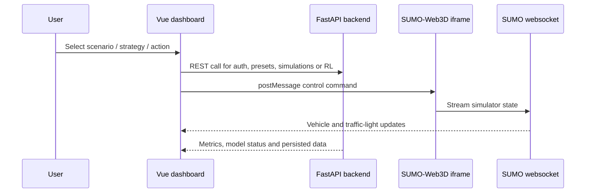

# Frontend: Vue Dashboard

The frontend is the browser dashboard for VROOM. It is a Vue/Vite application with Pinia stores, Vitest tests and a dashboard layout for controlling scenarios, viewing metrics, managing account data and embedding the SUMO-Web3D simulation.

## Responsibilities

| Area | What it does |
| --- | --- |
| Dashboard | Main traffic-control workspace in `src/views/DashboardView.vue`. |
| Authentication | Login/register views and auth store for backend JWT flow. |
| Scenario controls | Selects traffic profile, strategy and update interval. |
| Simulation view | Embeds and coordinates the SUMO-Web3D map. |
| Metrics | Shows queue length, throughput, reward and related KPI data. |
| Model interaction | Uses the backend RL endpoints through the `UseRL` store. |
| Tests | Component, store, router and service tests in `src/__tests__/`. |

## Project Structure

```text
frontend/
|-- src/
|   |-- views/                 # Dashboard, login and register pages
|   |-- components/
|   |   |-- dashboard/         # Dashboard shell, header, sidebars, KPI cards
|   |   |-- tabs/              # Traffic map, metrics, logs, AI decisions, account settings
|   |   |-- sumo/              # SUMO-specific controls and metadata components
|   |   |-- traffic/           # Traffic counters/fullscreen controls
|   |   |-- common/            # Notifications
|   |   `-- ui/                # Shared input/button/label components
|   |-- composables/           # `useSumoBridge` iframe/message integration
|   |-- stores/                # Pinia stores: auth, account, notifications, RL
|   |-- services/              # API service helpers
|   |-- router/                # Vue Router setup
|   |-- styles/                # Global theme and CSS
|   `-- __tests__/             # Vitest suites
|-- Dockerfile.dev
|-- Dockerfile.prod
|-- nginx.conf
|-- package.json
`-- vite.config.js
```

## Running the Frontend

The recommended way is the full compose stack through the VROOM menu from the repository root:

```bash
./vroom.sh
```

Choose option `2` (`Start Development`). Direct Makefile equivalent:

```bash
make dev
```

Use `make dev-build` manually when you specifically need a rebuild.

Then open `http://localhost:5173`.

If the backend and simulator are already running and you only want the frontend locally:

```bash
cd frontend
npm install --legacy-peer-deps
npm run dev
```

Useful npm scripts:

| Command | Purpose |
| --- | --- |
| `npm run dev` | Starts Vite on `0.0.0.0` for local/Docker development. |
| `npm run build` | Builds the production frontend. |
| `npm run preview` | Serves the built app through Vite preview on port `5173`. |
| `npm run test:unit` | Runs Vitest with coverage using `vitest.config.js`. |
| `npm run test:e2e` | Starts the dev server and runs Playwright tests. |
| `npm run lint` | Runs the configured lint tasks. |
| `npm run format` | Formats `src/` with Prettier. |

The project uses Node 20 according to `package.json`:

```text
^20.19.0 || >=22.12.0
```

## Integration Flow



The main bridge code is `src/composables/useSumoBridge.js`. It coordinates iframe commands and dashboard state. Backend communication is handled through stores and services, especially `src/stores/UseRL.js` and `src/services/simulationService.js`.

## Docker

| Dockerfile | Used by | What it does |
| --- | --- | --- |
| `Dockerfile.dev` | `docker-compose.yml` | Installs dependencies and starts Vite with HMR on port `5173`. |
| `Dockerfile.prod` | `docker-compose.prod.yml` and CD | Builds static assets and serves them through Nginx. |

In development the source folder is mounted into the container, with `/app/node_modules` kept as a container volume. That gives quick reloads without replacing installed container dependencies.

In production, the frontend is reached through the gateway:

```text
http://localhost/
```

The production Nginx gateway routes API and simulator traffic separately, so the frontend can use the same origin through `/api/`, `/map/` and `/ws-simulator/`.

## Tests and Coverage

Run all frontend unit tests:

```bash
cd frontend
npm run test:unit
```

From the repository root:

```bash
make test-frontend
```

Vitest writes coverage to `frontend/coverage/`. CI reads `coverage/coverage-summary.json` and uses it for the README badge update after deployment.

## Notes for Development

- Keep dashboard API assumptions in sync with the FastAPI routes in `backend/app/api/routes`.
- The simulator is a separate service; frontend map issues can come from frontend code, iframe messaging, SUMO-Web3D HTTP routes or websocket state.
- The frontend package currently pins Vue through `overrides` to beta packages. Use `npm install --legacy-peer-deps` when dependency resolution complains.
- Dashboard changes usually need at least a focused component/store test because most state is shared through Pinia.
