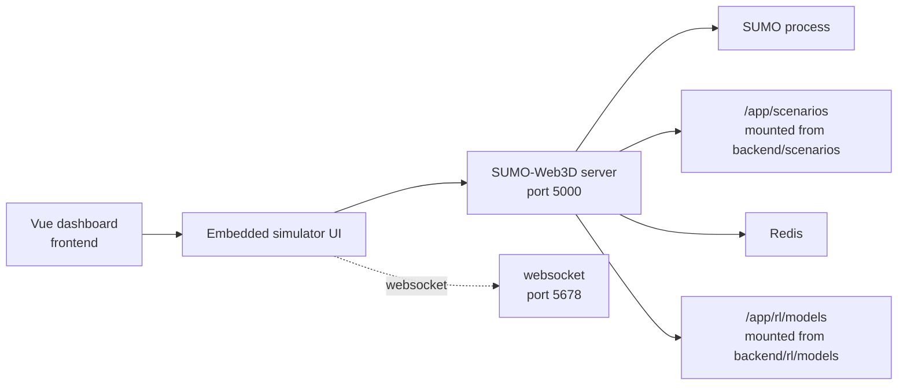

# SUMO-Web3D: 3D Simulator Service

This folder contains the 3D simulation service used by VROOM. It combines a Python server, SUMO/TraCI integration and a Vue/Three.js frontend to render the Hasselt XL traffic simulation in the browser.

The project started from SUMO-Web3D, but in this repository it is wired into the VROOM stack: scenarios are mounted from `backend/scenarios`, trained models are mounted from `backend/rl/models`, and the main dashboard embeds the simulator through `/map/` or direct development ports.

## Role in VROOM



The service exposes:

| Port | Purpose |
| --- | --- |
| `3000` | Vite development client. |
| `5000` | Python/SUMO-Web3D HTTP server. |
| `5678` | Websocket stream for live simulator updates. |

In production these are normally reached through the root gateway:

| Gateway path | Target |
| --- | --- |
| `/map/` | SUMO-Web3D HTTP server on port `5000`. |
| `/ws-simulator/` | SUMO-Web3D websocket on port `5678`. |

## Running It

Use the full VROOM stack from the repository root:

```bash
./vroom.sh
```

Choose option `2` for development. Direct Makefile equivalent:

```bash
make dev
```

Use `make dev-build` manually when the Docker image has to be rebuilt.

Then open:

```text
http://localhost:5000
http://localhost:3000
```

For production-style routing:

```bash
./vroom.sh
# choose option 3

# direct equivalent
make prod
```

Then open:

```text
http://localhost/map/
```

## Docker Setup

| Dockerfile | Used by | Notes |
| --- | --- | --- |
| `Dockerfile.dev` | `docker-compose.yml` | Development server with mounted source, scenarios and model folder. |
| `Dockerfile.prod` | `docker-compose.prod.yml` and CD | Production build used behind the Nginx gateway. |

Development compose mounts:

```text
./backend/scenarios -> /app/scenarios
./backend/rl/models -> /app/rl/models
./sumo-web3d -> /app
/app/node_modules
```

Important environment variables:

| Variable | Value in compose | Meaning |
| --- | --- | --- |
| `SUMO_HOME` | `/usr/share/sumo` | SUMO installation path in the container. |
| `SUMO_SCENARIO` | `/app/scenarios/hasselt_xl/osm.sumocfg` | Default SUMO config. |
| `REDIS_HOST` | `redis` / `redis-prod` | Runtime Redis host. |
| `REDIS_PORT` | `6379` | Runtime Redis port. |
| `VITE_BASE_URL` | `/map/` | Base path used when served behind the gateway. |
| `ENV` | `development` / `production` | Runtime mode. |

## Source Layout

```text
sumo-web3d/
|-- sumo_web3d/
|   |-- server/              # Python server, routes, websocket handling and SUMO worker
|   |-- scenarios/           # Bundled scenario copy/assets
|   |-- static/              # Vehicle models, textures and other static assets
|   `-- sumo_web3d.py        # Python entry point
|-- src/
|   |-- components/          # Vue sidebar, map controls and metadata UI
|   |-- controls/            # Camera and keyboard controls
|   |-- three/               # Three.js scene, materials, vehicles, network rendering
|   |-- utils/               # Coordinate and SUMO helpers
|   |-- main.ts
|   `-- sumo3d.ts
|-- package.json             # Vite/Vue/Three.js scripts and dependencies
|-- requirements.txt         # Python dependencies
|-- Dockerfile.dev
`-- Dockerfile.prod
```

## Local Development Outside Docker

Docker is the least painful path because it provides SUMO and the expected mounts. If you run this service manually, install both Python and Node dependencies and make sure `SUMO_HOME` points to a valid SUMO installation.

```bash
cd sumo-web3d
pip install -r requirements.txt
npm install
npm run dev
```

The package scripts are:

| Command | Purpose |
| --- | --- |
| `npm run dev` | Starts the Vite dev client. |
| `npm run build` | Type-checks and builds the Vue/Three.js client. |
| `npm run preview` | Serves the built client locally. |
| `npm run typecheck` | Runs `vue-tsc --noEmit`. |
| `npm run lint` | Runs ESLint with fixes. |
| `npm run format` | Formats Vue, TypeScript, JavaScript and CSS files. |
| `npm run test` | Runs Vitest. |

## Simulator Behavior

The Python server starts and communicates with SUMO through TraCI. The client renders the road network, vehicles, traffic lights and simulation metadata with Three.js. Updates are sent incrementally so the browser does not need to reload the full network state every tick.

Useful UI features:

- Scenario selection for available SUMO configurations.
- Pause/resume and restart controls.
- Camera pan, zoom and rotate controls.
- Search/navigation helpers for vehicles and traffic lights.
- Metadata display for selected simulation objects.

## Adding or Updating Scenarios

VROOM scenarios are expected under:

```text
backend/scenarios/hasselt_xl/
```

The simulator container sees that folder as:

```text
/app/scenarios/hasselt_xl/
```

When adding a scenario, include the `.sumocfg`, route/trip files and network/poly files required by SUMO. If the scenario should appear in a dropdown, update the scenario registry used by the server (`sumo_web3d/scenarios.json` or the mounted scenario metadata, depending on the flow you are touching).

Keep scenario paths container-friendly. A path that works on Windows directly may not work inside Linux-based Docker containers unless it is mounted through Compose.
